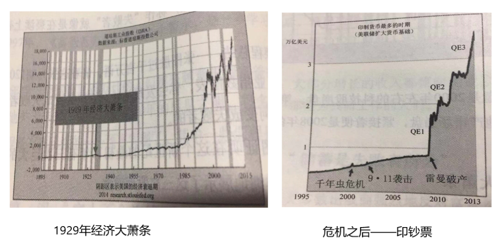
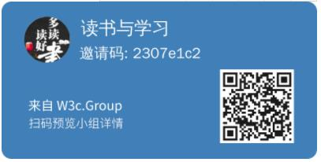

# 富爸穷爸第0课：后见之明&序言

>  **富人不会为钱而工作，储蓄是失败者所为，你的房子并非资产。**

罗伯特.清崎（著）@亚军（读） 2020-1-9


------

《富爸爸穷爸爸》这本书是我自己开始学习理财投资时比较早读到的一本书，而那时已经是此书出版发行20年以后，我想在接下来的时间里再通过不同的方式仔细去阅读、思考本书的一些观点，并希望将书中作者对财富的观点和我个人的理解感受分享给能看到的人，希望你我都有所帮助、小的启发，那怕是一个概念触动。


## **计划和方式**

那具体是什么计划和方式呢？计划是这样：这本书共9章，加上前言共计10个部分，分十次对书中每个章节进行学习，大约一个半月时间学习完毕。具体的方式：首先是对书中作者观点进行系统学习，然后结合我个人（可以视为一个小白、一个从无投资意识的人.....一个普普通通的人）实际分享自己的理解和感受。

今天2020年1月9日，今天我们开始第一课。在第一个课我们学习书中后见之明和序言部分。通过这两小节，我们可以大体了解本书的基本背景、观点，我相信也会激发您继续阅读本书的兴趣。

------


## **后见之明**

《富爸爸穷爸爸》在20年前就已发行，那是1997年4月8日，但在当时没有很快获得商业上的成功，而是迎来如风暴般的批评，因为大多数出版商不喜欢、不同意富爸爸的金钱观。但是20年后，全球数以百万计的人们越来越意识到富爸爸的警示。

1. 富爸爸的第一课：“富人不会为钱而工作”。

   今天，人们越来越意识到富人和其他人之间的差距。在1993年2010年期间，美国超过50%的国家收入都被1%的富人占有。在那之后，情况更糟，加利福尼亚的经济学家发现，在2009年到2012年期间，95%的国家收入都进入到1%富人的口袋。

   <u>**总结：大部分增长的收入都流向企业家及投资者，而并非劳动者——那些为钱而工作的人们！**</u>

2. 富爸爸课程：“储蓄是失败者所为”

   对于穷人和中产阶级来说，“存钱”是他们的信仰，可将他们从贫穷中拯救出来，保护他们在这个残酷的世界中不受伤害。对于很多人来说，把储户称作“失败者”就像是在亵渎上帝之名一样。

   总结：一张图胜过千言万语。1929年经济大萧条——》印钞票——》拯救富人。

   

   在2000年到2016年期间，打着拯救经济的名义，世界各地的银行开始降低利率和印制钞票。然而我们的领导们却要我们相信他们是在拯救世界，实际上，富人只是在拯救自己，并没有将穷人和中产阶级拉上被拯救的列车。

   **<u>今天，许多国家的利率都低于零，这也是说储蓄是失败者所为的原因。如今最大的输家是穷人和中产阶级，他们为钱工作，然后把钱存起来。</u>**

   > 感兴趣的朋友的可以看下这篇文章，[美国百年印钞史](http://www.sohu.com/a/216569186_313170)，告诉你这个大膨胀时代：以货币数字来计算，人们所拥有的一切资产、财富都在膨胀，膨胀再膨胀，从中国大城市房产到美国股市，从日本国债到全球科技股，再从德国国债再到A股的白马股，不管其价格有多高，似乎其上涨可以做到永无休止……
   >
   > ```
   > 从1913年美联储成立到2017年年终：
   >   美元基础货币，从34.7亿美元暴增至现在的3.85万亿美元，增长了1100倍！
   >   美元广义货币，从不到300亿美元暴涨至现在的13.79万亿美元，增长了460倍！
   > 更近的，从1971年布雷顿森林体系垮台到2017年年终：
   >   MB，从659亿变到3.85万亿，增长了58倍！
   >   M2，从6330亿变到13.79万亿，增长了增长了22倍！
   > 这几个数据，最好的回答了我们最初的那个问题：为什么资产的数字价格如此不顾廉耻的膨胀？
   > 从美联储的百年印钞史上，我们可以看到，人类发展的趋势，就是将越来越多的财富变成证券，变成信用，
   > 变成金钱，变成可交易的数字，而认知不到这个趋势的人，固守着原来的劳动和技能，注定会在社会财富
   > 竞赛中失败，变为微不足道的尘埃、卑贱到泥土里……
   > ```

3. 富爸爸课程：“你的房子并非资产”

   2007年，当次贷者开始拖欠贷款的时候，全球房地产泡沫开始破裂，数百万的房产持有人以惨痛的代价发现了这个事实——他们的房子并非资产。

   大部分人并不知道房地产市场的崩溃并不是真正的崩溃。穷人并没有引起房地产市场的崩溃，那是富人们导致的。富人们设计了一系列衍生性金融产品——这些产品被沃伦巴菲特称为“大规模杀伤性武器”。当这个武器爆炸的时候，房地产市场崩溃了......然后穷人们、次贷者们便受到谴责。

4. 富爸爸课程：“为什么人富人缴的税更少”

   当特朗普总统承诺减少穷人和中产阶级的税收时，实际上富人总是可以缴更少的税。富人缴更少的税的原因可以追溯到“富人不会为了钱而工作”，只要一个人为了钱而工作，他就要缴税。

   ------

   

## **序言**

我有两个爸爸，一个富，一个穷。一个受过良好的教育，聪明绝顶，拥有博士头衔，另一个却连八年级都没读完。两个爸爸事业都相当成功，而且一辈子都非常勤奋，他们都有着丰厚的收入。然而，其中一个人终其一生都在个人财务问题的泥沼中挣扎，另一个则成为夏威夷最富有的人之一。一个爸爸去世后为家人、慈善机构和教堂留下数千万美元的遗产，而另一个爸爸只留下一些待付的账单。

两个爸爸都给我建议，这就为我提供了一个在截然不同的观念间进行选择的机会，即选择富人的观念或穷人的观念。

那两个爸爸经常说些什么呢？

> 穷爸爸说，贪财乃万恶之源。
>
> 富爸爸说，贫穷才是万恶之本。

> 穷爸爸说，努力学习吧，那样你就能去好公司工作。
>
> 富爸爸说，努力学习吧，那样你就能发现一家好公司并收购它。

> 穷爸爸说，我不富有，因为我有孩子。
>
> 富爸爸说，我得富有，因为我有孩子。

> 穷爸爸说，当涉及钱的时候要小心，别去冒险。
>
> 富爸爸说，要学会管理风险。

> 穷爸爸说，房子是最大的投资和资产。
>
> 富爸爸说，房子是负债，如果你的房子是你最大的投资，你就有麻烦了。

> 穷爸爸说，我对钱不感兴趣，钱对我来说不重要。
>
> 富爸爸说，金钱就是力量。贫穷和破产的区别是，破产是暂时的，而贫穷是永久的。

> 穷爸爸说，你应该沿着公司的梯子，一步一步往上爬。
>
> 富爸爸说，为什么不当梯子的主人？

同时，两个爸爸又是怎么做的呢？

> 在遇到钱的问题时，穷爸爸习惯于逃避，富爸爸则总是想办法解决问题。
>
> 在观念上，穷爸爸认为富人应该多缴税去照顾那些相对不幸的人，富爸爸则认为税是惩勤奖懒。
>
> 在吃饭时，一个爸爸提倡在餐桌上讨论钱和生意，而另一个爸爸则禁止在吃饭时谈论这些话题。
>
> 付账单时，两个爸爸都准时，但一个预先支付账单，另一个到限期才支付账单。
>
> 在理财方面，一个爸爸努力存钱，一个爸爸则不断投资。
>
> 一个爸爸教我怎样去写一份简历以便找到一份好工作，另一个爸爸则教我写下雄心勃勃的事业规划和财务计划，进而创造创业的机会。
>
> ... ....

尽管思想的力量无法测量或评估，但当我还是一个孩子时，我就已经知道，明白自己内心的想法，也知道如何表达自己是多么重要。我注意到穷爸爸之所以穷，不在于他挣钱的多少（尽管这也很重要），而在于他的想法和行为。人们的思想确实可以决定他们的生活，一个人的观念对于他的一生影响巨大！

富人之所以越来越富，穷人之所以越来越穷，中产阶级之所以总在债务的泥潭中挣扎，其中一个主要原因就是他们对金钱的认识不是来自学校，二是来自家庭。学校并不开设有关“金钱”的课程，学校只专注于学术知识和专业技能的培养，却忽视了理财技能的培训。

选择不同，命运也会不同。钱是一种力量，但更有力量的是财商教育。

在我9岁那年，我最终决定听从富爸爸的话并向他学习有关钱的知识。“我要让钱为我工作”。


## 亚军想说

以上两节是本书的背景及前言的部分内容，通过上面我们可以了解作者要告诉我们什么？那就是富人和穷人到底有什么区别，富人在想什么，富人在做什么，怎样成为富人。今天，我想分享两点感受：

> **观念认知决定一切**。

我们普通人或者周边大部分人都认为好好工作就是生活，找一个好工作然后获取稳定的收入就能挣到钱！对于“你不理财、才不理你“的说法更是不屑，因为没钱就谈不上理财，等我有钱了就理财。更没仔细研究富人为什么那么有钱，偶尔会以为那只是个人运气、机会好而已也就不再深思。是的，我一直就是这么认为，然后也就拼命的工作，但是依然不是富人，依然疲于奔命。

在看到老爸二十年前的存款到如今还是那个数字、老爸感叹钱不值钱时，在看到书中观点“储蓄是失败者所为”、以及富人不为钱工作的观点时，更特别是富爸爸和穷爸爸对同一事情完全相反的观点和行动对比时，我才略有所悟：观念决定你的未来，你的所有只因为你目前的见识和认知范围所决定！你看不见、看不到、看不起就更不可能想到、做到，那么你必定依然在现有的环境和生活中日复一日，周而复始。不要幻想天上会掉馅饼并让你一夜暴富而扬眉吐气、改天换地。

所以，观念认知决定一个人的未来，无可厚非。

> **要做“白马+黑马+骑手”**

那如何提升你意识或者认知呢？唯有学习。你当前的观念和见解是缘由你之前的学习积累和习惯修得，人，需要不断进化升级自己的操作系统，提升自己思想和认知的性能，升级你的内核。

听笑来老师讲课提到一个模型，“白马+黑马+骑手”，一个人，需要学会驾驭一个人天性、内心的白马和黑马，白马理性积极，黑马感情消极。所以，一个人对于外界任何的观点、看法反馈到自己脑子时，你的白马就会建议你要理智、要积极去学习、去理解、去发现，而你的黑马则告诉你要跟着感觉走、顺着情绪发挥就好，此时，当你的骑手不能很客观的分析、平衡这种内心白马黑马的怂恿，那你的表现就是偏走极端，要么黑、要么白。所以，我们要通过学习、训练，去做一个通过骑手可驾驭白马、黑马的人，一个可以融合三者的人：遵从理智、控制情感、平衡内心。


------

> **说明**

1. 本文内容主要来源于《富爸爸穷爸爸》一书。

2. 全书内容抢先知道：[三读《富爸爸穷爸爸》（罗伯特-清崎）](https://w3c.group/c/1578042683991669)

3. 本书豆瓣评论——[豆瓣介绍](https://book.douban.com/subject/3291111/)，作为扩展了解。

4. 本书（20周年修订版）购买链接：[亚马逊](https://www.amazon.cn/b?node=1941075071&ref=cn_ags_top_nav_item_658399051_merchandised-search-top-3)、[京东](https://item.jd.com/28788556670.html)

5. 想了解和深入学习投资知识，请加微信：denzii，咨询了解区块链mixin平台，带你进践行群接触投资大佬，系统学习英语、编程、沟通、写作、财务、销售等知识，提升个人操作系统。

6. 喜欢读书的朋友可以关注或加入我的小组【读书与学习】（创作、激励、协作，区块链主导的创作者社区），分享你的读书感想，讨论新的读书计划，组队一起践行读书与学习，点击链接或者二维码免费加入。

   [W3C社区小组：读书与学习 ](https://w3c.group/g/1124622/join?ref=2307e1c2) 

 

