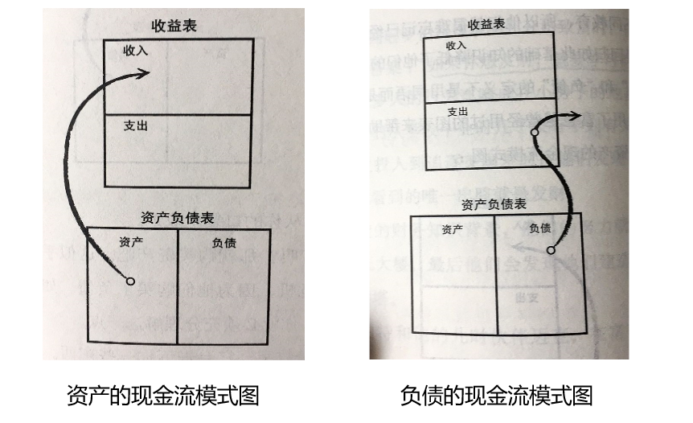
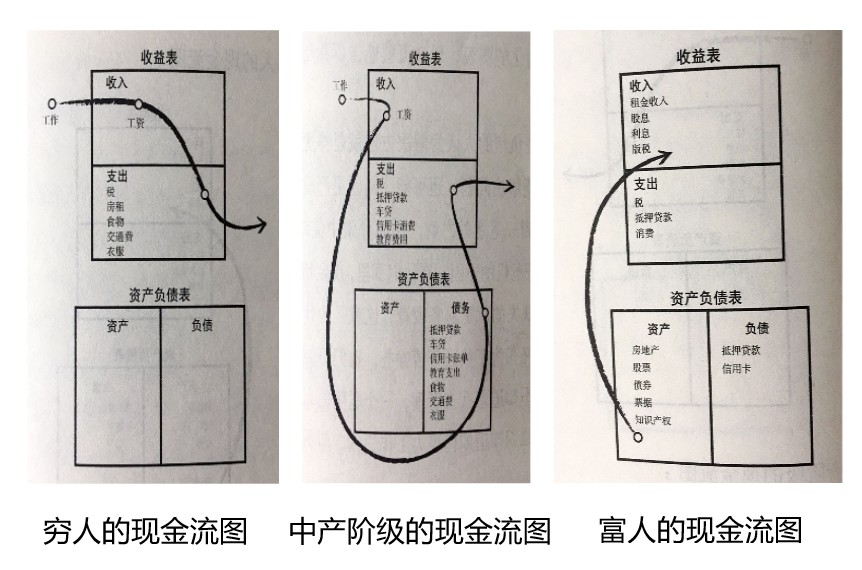

# 富爸穷爸第2课：为什么要教授财务知识

> **——重要的不是你挣了多少钱，而是你能留下多少钱。**

 罗伯特.清崎（著）@亚军（读） 2020-1-13

------

今天我们一起继续学习《富爸爸穷爸爸》这本书，上节我们学习了第一章“富人不为钱工作”，通过罗伯特和他的小伙伴一起到富爸爸的小超市打扫卫生的故事开始，他们学到了让金钱为他们工作的第一课，即使他们不在那儿，钱也会为他们工作。

好，今天我们学习第2课：为什么要教授财务知识。

## **故事概要**

> 差不多35年后，我们再来看看罗伯特和迈克的情况。迈克他爸爸的公司，做得比富爸爸还要好。至于罗伯特，他在1994年也就是他47岁的时候退休了。他和他妻子的财富会自动增长，就像是一棵被培植得很好的大树一样。
> 
>他分享了一个一些最伟大的领导人和最富有的商界人士在1923年开会的故事——他们当中有人拥有最大的钢铁公司和煤气公司，有人经营纽约证券交易所，有人是内阁成员。然而25 年之后，他们大多都落得悲惨的结局，有人破产，有人被流放，有人则被关进监狱。1929年的股市大崩溃和大萧条可能影响了他们的命运，但今天我们生活在一个比那时更混乱、变化更快的时代。在这个时代，比钱更重要的生存之道是我们所受的教育和学习的能力。重要的不是你挣了多少钱，而是你能留下多少钱，以及能够留住多久。
> 
>所以当人们问起罗伯特该从哪儿开始致富时，他告诉他们富爸爸曾告所他的答案：“如果你想发财，就要学习财务知识。”罗伯特把很多人的行为比喻成在小房子的地基上建造摩天大楼，因为孩子们从学校毕业时几乎没有学到有关财务的知识，而当他们把人生投投入到追逐美国梦时，他们发现自己深陷债务危机。他们可以看到的唯一出路就是发财。
> 
>但没有一定的财务知识背景，他们的努力就像是在脆弱的地基上建造摩天大楼，最后他们会发现他们建造的不是帝国大厦，而是一座斜塔。然而，罗伯特和他的儿时伙伴迈克，在富爸爸的教导下，打下了坚实的财务知识基础，完全可以盖摩天大楼。
> 
>会计作为一门学科是枯燥和让人费解的——但对于达到财务上的成功来说又是非常重要的。为了让孩子们更容易接受，富爸爸采用图表的形式来给两个孩子教学。只有到后来他才加人一些数字来给孩子们解说核心概念。
> 
>首要的规则，罗伯特说，就是你必须明白资产和负债的区别，并且只购买资产。这就是所有你应该知道的。尽管这很简单，但是很多人仍然不能够理解。当富爸爸第一次向两个孩子解释这些的时候，他们以为他在开玩笑。这么简单的道理大人怎么会不明白？难道不应该每个人都能成为富人吗？问题是大多数人已经接受了来自银行家、财务规划师或其他领域专家的不同教育，所以他们很难忘记已经学过的东西，有些人甚至觉得得回归如此基础的知识降低了他们的水平。
> 
>对“资产”和“负债”的定义不是用词语而是用数字来表达。罗伯特采用了富爸爸曾经用过的图表来帮助读者理解。
> 
>
> 
>上图左边是一张资产的现金流模式图，图表的上半部分是收益表，也常被称为损益表，它被用来衡量收入和支出：金钱的进入和流出。图表的下半部分是资产负债表，它被用来说明资产和负债的情况。资产增加你的收人，它能把钱放进你的口袋。
> 
>上图右边是一张负债的现金流模式图，负债会把钱从你的口袋里取走。想变得富有吗？那就购买资产吧。这似乎很容易，但很多人陷入了财务危机，因为他们购买了负债。如果你想得到或者保住你的财富，你就必须充分理解这一点。这并非只是数字，它会告诉你一些东西。跟随图中的箭头来看看金钱是怎么流动的，或者说是“现金流”。它会告诉你财务状况的细节。
> 
>
> 
>上图左边是一张穷人的现金流图、中间是一张中产阶级的现金流图、右边是一张富人的现金流图！通过这些简化的图表现金流的对比就能告诉你每个人怎么处理自己的钱。
> 
>通常，那些负债的人认为解决方法就是挣更多的钱。但更多的钱不仅不能解决问题，还可能让问题更严重。这也是为什么很多人在得到一笔意外之财，比如彩票中奖或者遗产之后，很快又陷人财务危机的原因。在他们那里，现金越多，花得越多。大部分人缺失的就是财务教育。这就是为什么他们在职业上很成功但始终在为了钱而苦苦挣扎。他们可能已经学会了怎么挣钱，但却不知道怎么去管理。一个聪明的人，也可能是财务上的文盲。他们知道如何努力工作挣钱，却不知道如何让钱为他们努力工作。
> 
> 罗伯特讲了一对新婚夫妇开始共同生活的故事。随着他们收入的增长，他们的支出也在增长。和大多数人一样，这对夫妇的第一项支出是税。对于许多人来说，最沉重的压力不是来自个人所得税而是社会保险。它的税率大概为15% (社会保险和医疗保险的税率加在起，所有这些都是雇主拿他本该付给雇员的钱去支付的)。在这个量的基础上，雇员还要支付个人所得税。
>
> 这对年轻的夫妇也面临着这些税的问题，当他们买了房之后，还有房地产税。伴随新房子而来的是一辆新车， 新的家具，以及新的电器。突然间，他们的负债就上来了，到处是抵押债务和信用卡债务。这对夫妇落人了“老鼠赛跑”的陷阱。再加上新生的宝宝，于是他们更加努力工作：更高的收人导致了更高的税收。他们的账单不断增多，最终将他们的房屋抵押获得一个债务合并贷款。但是他们的消费习惯没有改变——所以信用卡债务一直持续着——更别提他们已经加重的家庭债务。对于这对夫妇以及像他们这样的人来说，真正的问题是不懂得怎么处理他们手中的钱。这也是由缺乏财务知识以及不理解资产和负债的区别引起的。
>
> 很多人不愿意花时间问这样一个问题：这有意义吗？他们只是简单地随波逐流。他们总会轻率地重复别人告诉他们的东西：“分期付款”、“你的房子就是你的资产“、“欠债可以抵税”、“找一个稳定的工作”、“别犯错误”、“别冒险”。 因为罗伯特和迈克花了大量时间列席富爸爸与他身边的聪明人的会议，所以他们学到了很多——他们开始质疑学校教的准则。这引起了一些问题，他们与他们的老师们的距离越来越远。
>
> 在钱的问题上，罗伯特也开始不同意自己父亲的观点，特别是当他的穷爸爸提到他的房子就是他最伟大的投资的时候。相反，富爸爸把他的房子当作一项负债。很多人仍然相信他们的房子就是资产。但罗伯特教育他们说房子是负债，因为它把钱从你的口袋里拿走了——不仅仅因为那些伴随着房子的税收和支出，更因为房子的贬值和你把所有的钱都投在房子上后丢失的致富的机会，这也导致了你失去了学习投资经验的机会。
>
> 这并不表示你不能购买一个大一点的房子，而是首先要购买资产，以确保它所创造的现金流能支付你的房子。当你有足够的资产能产生大于支出的收人时，剩余的收入还可以对资产项进行再投资。这样，你的资产负债表上的资产项会不断增加，收人也会随之增加。结果便是能够分清资产和负债的富人变得更富。
>
> 中产阶级深陷“老鼠赛跑” 的陷阱是因为他们把房子当作资产，而没有把钱投在那些能带来收人的资产上。他们深陷其中还因为他们最重要的收人就是工资，而当工资增加的时候，税收也就增加了。许多人购买了共同基金，请一个经理来管理他们的账户，因为他们没有时间或者专业知识来自己管理。他们觉得共同基金是安全的，他们也必须保证安全，因为他们的资产负债表是不平衡的。他们不能抓住机会，因为他们的债务已经爆表，只能靠工资带来一些收入。
>
> 想变得富有吗？努力去购买创造收入的资产吧——当你真正理解什么是资产的时候，降低负债和支出，这会使你的资产不断增多。那么如何知道自己是否富有了呢？罗伯特引用了巴克敏斯特-富勒的定义：“**<u>财富就是支撑一个人生存多长时间的能力，或者说，如果我今天停止工作，我还能活多久？</u>**”用另一个方式来阐述：财富是将资产项产生的现金与支出项流出的现金进行比较而定的。当你的资产项能产生足够的收人来填补你的支出时，你就是富有的，即使你还没有什么钱。
>

## **罗伯特说了什么**

> 重要的不是你挣了多少钱，而是你能留下多少钱。
>
> 只有知识才能解决问题并创造财富，那些不是靠财务知识挣来的钱也不会长久。
>
> 如果你要去建造帝国大厦，你要做的第一件事就是挖个深坑，打牢地基。如果你只是想在郊区盖个小屋，你只须用混凝土打15厘米厚的地基就够了。大多数人在努力致富时，总是试图在15厘米厚的混凝土上建造帝国大厦。
>
> 富人获得资产，而穷人和中产阶级获得负债，只不过他们以为那些负债就是资产。
>
> 如果你的模式是把收入都花掉，那么最可能的结果是在增加收入的同时也会增加支出。
>
> 80%的家庭的财务报表表现的是一幅拼命工作、努力挣钱的图景，然而他们的努力都打了水漂，因为他们购买的是负债而非资产。
>
> 大多数人并不真正懂得钱的意义，因此只能被钱控制。
>
> ... ....

## 亚军想说

> 为什么要教授财务知识？

书中给了一个答案，那就是不在于你能挣多少钱，而在于你能留下多少钱。学习财务知识就是为了让人更好的理解财富、理解钱。这让忽然想到一个人：李笑来。前几天在听李笑来讲课时，李老师在看到践行群里好多人并没有很好的、花时间去学习群里开设的课程，比如编程、英语、逻辑、财报等一系列课，这可能是大家觉得这些课程与投资理财没多大关系。李老师说，这些课程与大家的关系非常大，他解释了一点，那就是在跟着践行群不断践行，经过两个大周期之后，你可能会财富自由，在这之后，你会考虑什么问题？那就是如何让自己的资产传承下去。那就是只能通过学习，培养自己的孩子有一个好财务知识、好的能力去传承。编程是当今社会高效工作的一种能力，英语更是走向全球的一项工具，逻辑则是沟通与表达的人的基本能力，阅读财报则是投资理财的入门必读。李笑来老师这个说法和这本书的观点是不是一致呢：不在于你能挣多少，而在于你能留下多少！所以，学习财务知识，不断学习，是我们现有每一个人都应去做的一件事。

> 你的房子是资产还是负债？

许多人认为我买的房子就是我的资产，我的房子还不断增值也就更值钱，可是罗伯特却说，房子不是资产而是负债。为什么？资产是可以给你不断带来现金流的东西，而负债是不断吞噬你现金流的东西。你买的房子，大部分人是贷款买房，那你每月需要从你的工作收入中拿出现金去还每月的房贷、银行的利息，并且在办理房产证时你还需要缴房子的契税等等，然后，房子住进去你每月还要缴纳水电费物业管理费等等，这些都在不断的拿走你的现金，所以，按照罗伯特的观点，房子就是负债。但是，我们要想想罗伯特的逻辑到底是什么？

罗伯特不是说，你不能买房，而应该这样买房：首先要购买资产，以确保资产所创造的现金流能支付你的房子。也就是说，用你资产项的收入、现金流去支付你房子的房贷支出，让你的资产、钱为你打工。若每个月你的现金收入还有剩余就继续买入资产，让你的资产不断越滚越大，不断为你创造现金收入，那你就越来越良性的在造福。

但是，我们需要想一想，在中国的这个社会，除了考虑房子的居住功能外，他还有其他功能，比如娶媳妇，这是丈母娘的评估条件呀，所以，我们每个中国人可能都在贷款买房，买了房自己住，然后房子还可以增值，至少保证自己的现金不贬值。所以，我认为在国内，房子可以认为是一种对自我现金保值增值的手段之一，特别是在过去的20年。但是，随着国家银行利率的下调、房子租金不高以及房子居住属性的提升，房子增值的空间可能会下降，我觉得房子能做到保值就很不错了。

另外，在中国，对于我们普通老百姓来讲，投资的出路太少，除了储蓄就是房子，储蓄现在证明肯定不行，那就是房子。所以，买房子在中国，对于普通老百姓来讲，是一个好的出路。我想说，这不仅仅是买了房子，更重要的是一种定投的的财务理念的践行，什么意思？对于普通老百姓，每月通过固定工作获得收入，将收入的很大一部分先投入到买房的房贷支出，剩余的部分作为日常开销或者其他理财投入，这种方法无疑强制让并无多少理财知识的人首先要将每月收入的一部分投入到购买资产（认为买房子就是投资资产）的项目上，雷打不动，不能违约，并且坚持一年、两年、三年、十年、二十年，甚至三十年。这实际就是在践行定投的策略，长期的视角去做一件事，从这个角度讲，这也是一种很好的投资方法，对普通人来说，或许好多人也没意识到而已。

------

> **说明**

1. 本文内容主要来源于《富爸爸穷爸爸》一书。

2. 全书内容抢先知道：[三读《富爸爸穷爸爸》（罗伯特-清崎）](https://w3c.group/c/1578042683991669)

3. 本书豆瓣评论——[豆瓣介绍](https://book.douban.com/subject/3291111/)，作为扩展了解。

4. 本书（20周年修订版）购买链接：[亚马逊](https://www.amazon.cn/b?node=1941075071&ref=cn_ags_top_nav_item_658399051_merchandised-search-top-3)、[京东](https://item.jd.com/28788556670.html)

5. 想了解和深入学习投资知识，请加微信：denzii，咨询了解区块链mixin平台，带你进践行群接触投资大佬，系统学习英语、编程、沟通、写作、财务、销售等知识，提升个人操作系统。

6. 喜欢读书的朋友可以关注或加入我的小组【读书与学习】（创作、激励、协作，区块链主导的创作者社区），分享你的读书感想，讨论新的读书计划，组队一起践行读书与学习，点击链接或者二维码免费加入。

   [W3C社区小组：读书与学习 ](https://w3c.group/g/1124622/join?ref=2307e1c2) 

   

